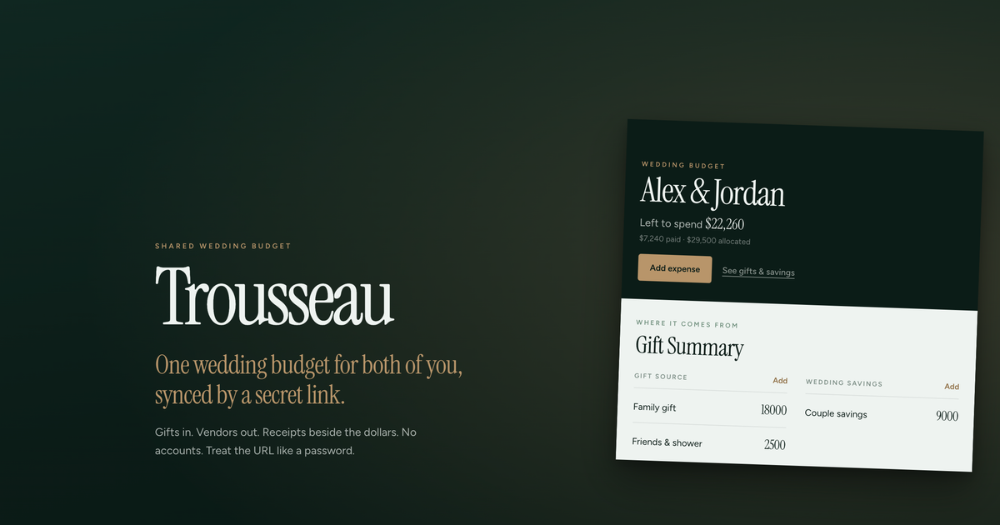

# Trousseau

[](https://github.com/smeltery/trousseau/actions/workflows/ci.yml)
[](LICENSE)
[](https://bun.sh)
[](https://react.dev)
[](https://vite.dev)
[](https://tailwindcss.com)
[](https://dexie.org)
[](.pre-commit-config.yaml)
[](https://flox.dev)

<p align="center">
  
</p>

Local-first wedding budget tracker. Gifts, vendor lines, and receipts stay in your browser. Rename anything. Export a zip when you need a backup.

```sh
flox activate   # optional, recommended
bun install
bun run dev
```

- `/`: marketing
- `/app`: tracker
- `/app?demo=1`: filled demo (asks before replacing local data)

## Docs

See [`docs/`](docs/) for getting started, how it works, privacy, and architecture. Contribution gates are in [`CONTRIBUTING.md`](CONTRIBUTING.md).
