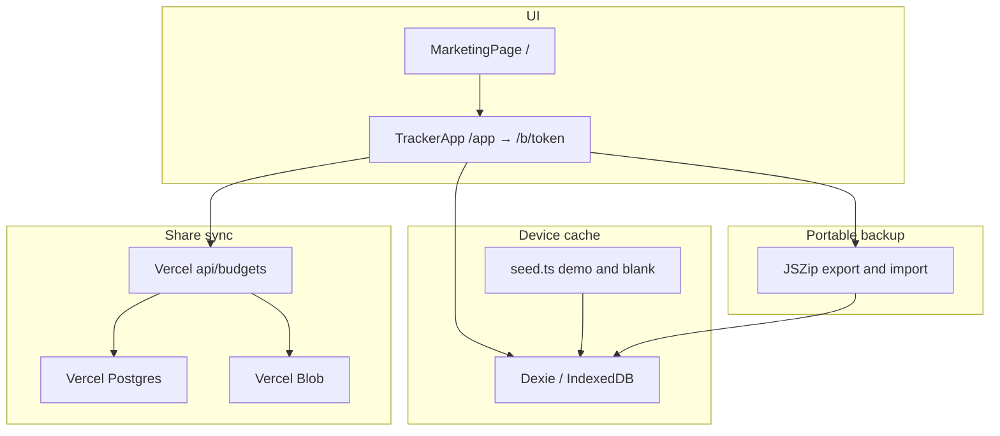

# Architecture

High-level shape of the Vite + React app with cloud share as the only budget mode.

| Layer | Location | Notes |
| --- | --- | --- |
| Routes | `src/main.tsx` | `/` marketing, `/app` boot → soft-navigate, `/b/:token` tracker |
| UI | `src/pages/`, `src/components/` | Marketing under `pages/marketing/` |
| Domain helpers | `src/lib/` | Money, site settings, backup, cloud client/sync, budget-store |
| Persistence | `src/db/` | Dexie cache, blank/demo seed, sample archive, lifecycle |
| Cloud API | `api/` | Token-gated budget CRUD + attachment upload |
| Local DB | `docker-compose.yml`, `api/_lib/db.ts` | Postgres 16 in Docker; `pg` when host is localhost |
| Local blobs | `api/_lib/blob-store.ts` | `LOCAL_BLOB_DIR` → `public/.local-blob`; else Vercel Blob |
| Schema | `scripts/migrate-cloud.sql` | One-shot SQL for shared budgets |

**Boot:** `/app` with a remembered token soft-navigates to `/b/:token`. Otherwise it seeds IndexedDB if needed, runs `ensureCloudBudget` (resume or publish), activates the cloud session, then soft-navigates so the tracker does not remount into a second splash. Import stays on `/app` until the zip + share succeed. `cloudBudgetStore` loads the API snapshot into Dexie; `dbWrite` debounces PUT sync. Focus/visibility pulls if the server `updatedAt` changed.

Dev tooling: Bun for install/scripts (including `sample:wedding`), Flox for a reproducible shell, pre-commit and CI for lint, typecheck, budgets, sample zip, and Markdown/mermaid hygiene. Local sync: Docker Postgres + `bun run dev:local` (see [getting-started](getting-started.md)). Production cloud APIs use `POSTGRES_URL` and `BLOB_READ_WRITE_TOKEN` on Vercel.
