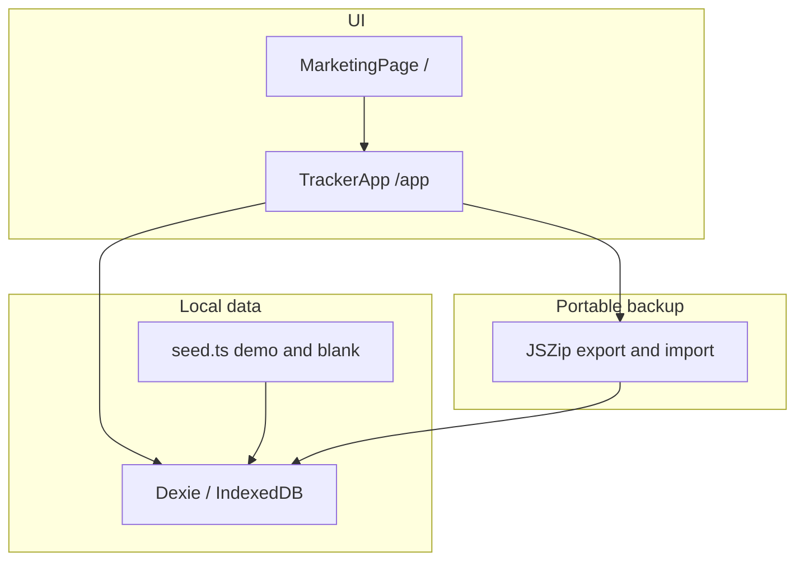

# Architecture

High-level shape of the Vite + React app.

| Layer | Location | Notes |
| --- | --- | --- |
| Routes | `src/main.tsx` | `/` marketing, `/app` tracker |
| UI | `src/pages/`, `src/components/` | Marketing split under `pages/marketing/` |
| Domain helpers | `src/lib/` | Money, site settings, export/import |
| Persistence | `src/db/` | Dexie schema, seed, lifecycle |

Dev tooling: Bun for install/scripts, Flox for a reproducible shell, pre-commit and CI for lint, typecheck, budgets, and Markdown/mermaid hygiene.
