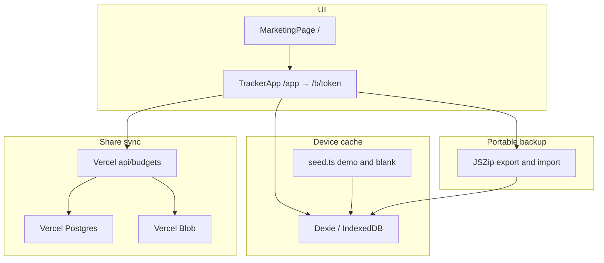

# Architecture

High-level shape of the Vite + React app with cloud share as the only budget mode.

| Layer | Location | Notes |
| --- | --- | --- |
| Routes | `src/main.tsx` | `/` marketing, `/app` boot → redirect, `/b/:token` tracker |
| UI | `src/pages/`, `src/components/` | Marketing under `pages/marketing/` |
| Domain helpers | `src/lib/` | Money, site settings, backup, cloud client/sync, budget-store |
| Persistence | `src/db/` | Dexie cache, blank/demo seed, sample archive, lifecycle |
| Cloud API | `api/` | Token-gated budget CRUD + attachment upload |
| Schema | `scripts/migrate-cloud.sql` | One-shot SQL for shared budgets |

**Boot:** `/app` seeds IndexedDB if needed, then `ensureCloudBudget` (resume remembered token or publish) and redirects to `/b/:token`. Import stays on `/app` only until the zip + share succeed. `cloudBudgetStore` loads the API snapshot into Dexie; `dbWrite` debounces PUT sync. Focus/visibility pulls if the server `updatedAt` changed.

Dev tooling: Bun for install/scripts (including `sample:wedding`), Flox for a reproducible shell, pre-commit and CI for lint, typecheck, budgets, sample zip, and Markdown/mermaid hygiene. Cloud APIs need `vercel dev` (or deployed env) with `POSTGRES_URL` and `BLOB_READ_WRITE_TOKEN`.
