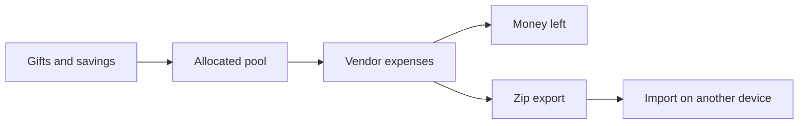

# How it works

Trousseau keeps gifts (money in), expenses (money out), and attachments on one page.

## Core loop

1. Record gifts and savings so you know the pool.
2. Add expense categories and line items (paid vs due).
3. Attach receipts or notes on a line when you need a paper trail.
4. Export a zip before clearing history or switching machines.

## Tracker surfaces

| Section | Role |
| --- | --- |
| Overview hero | Couple names, allocated / spent / remaining |
| Gift summary | Money coming in |
| Expenses | Venue and vendors with running totals |
| Backup | Export, import dialog, new blank, load demo, sample download |

## Blank, demo, and import

- `/app?new=1` asks before replacing local data with a blank starter.
- `/app?demo=1` asks before loading the filled generic demo.
- `/app?import=1` (or **Import** in the nav) opens the import dialog: drop or choose a Trousseau `.zip`, or download the sample wedding file first.

Decline a replace prompt to keep what you have (and seed blank only if this browser has never been seeded).
