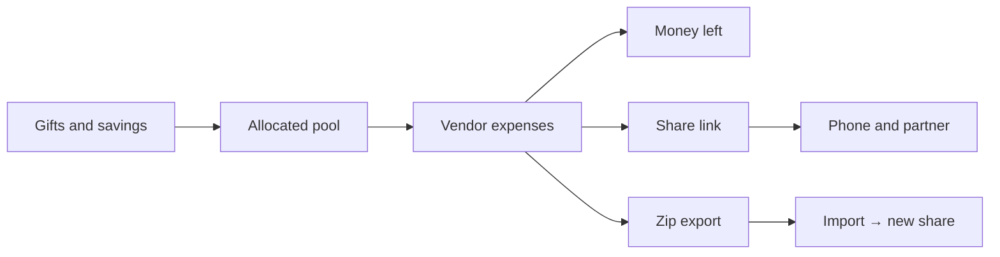

# How it works

Trousseau keeps gifts (money in), expenses (money out), and attachments on one page, synced through a secret share link.

## Core loop

1. Record gifts and savings so you know the pool.
2. Add expense categories and line items (paid vs due).
3. Attach receipts or notes on a line when you need a paper trail.
4. Share the URL with your partner; export a zip when you want an offline archive.

## Tracker surfaces

| Section | Role |
| --- | --- |
| Overview hero | Couple names, allocated / spent / remaining |
| Gift summary | Money coming in |
| Expenses | Venue and vendors with running totals |
| Backup | Export, copy share link, import, new blank, load demo |

## Blank, demo, and import

- `/app?new=1` asks before replacing data, then opens a new share link.
- `/app?demo=1` loads the filled generic demo and opens a new share link.
- `/?import=1` (or **Import**) opens the import dialog over the home page; restoring a Trousseau `.zip` creates a share link.

## Share link

- Opening `/app` resumes your last share link or creates one, then redirects to `/b/<token>`.
- Anyone with the URL can edit; the banner reminds you the link is the password.
- Edits sync to Postgres (receipts to Blob). Returning to the tab pulls newer server data.
- **Copy share link** recopies the URL.
