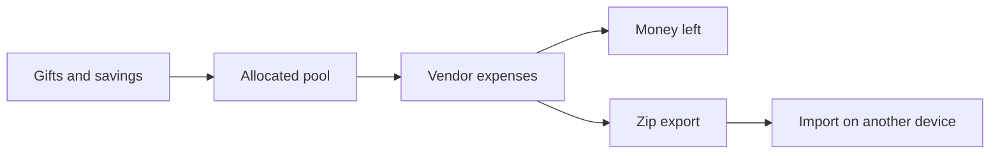

# How it works

Trousseau keeps gifts (money in), expenses (money out), and attachments on one page.

## Core loop

1. Record gifts and savings so you know the pool.
2. Add expense categories and line items (paid vs due).
3. Attach receipts or notes on a line when you need a paper trail.
4. Export a zip before clearing history or switching machines.

## Tracker surfaces

| Section | Role |
| --- | --- |
| Overview hero | Couple names, allocated / spent / remaining |
| Gift summary | Money coming in |
| Expenses | Venue and vendors with running totals |
| Backup bar | Export, import, reset, load demo |

## Demo vs blank

`/app?demo=1` asks before replacing local data. Decline to keep what you have and seed a blank tracker instead.
