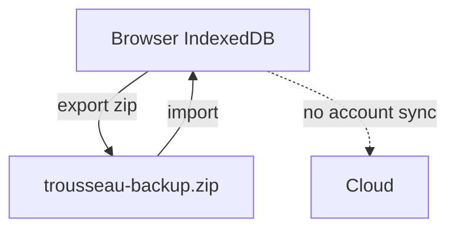

# Privacy

Trousseau does not create accounts or sync to a cloud ledger.

## What stays local

- Gift amounts and labels
- Expense categories and line items
- Attachment blobs stored in IndexedDB
- Editable page copy (names, section titles)

## What leaves the device

Only what you choose to export. A backup zip contains JSON plus attached files. Import replaces local data with that zip.

Clearing site data removes the budget unless you exported first.
