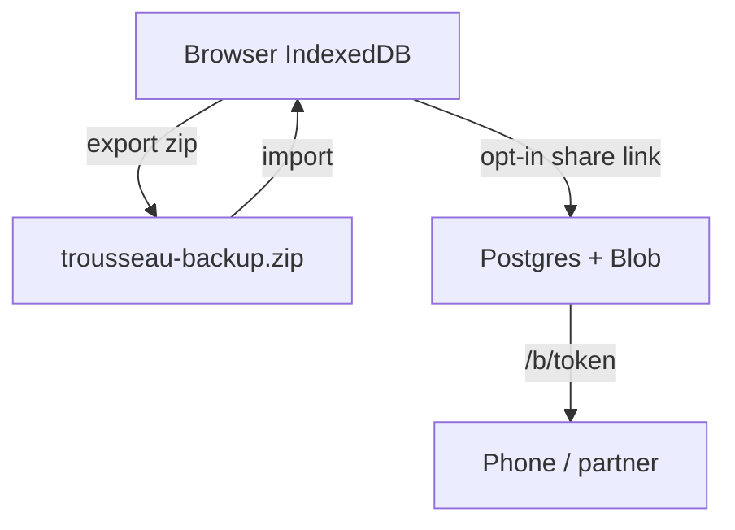

# Privacy

Trousseau is local-first. The default tracker does not create accounts.

## What stays local (`/app`)

- Gift amounts and labels
- Expense categories and line items
- Attachment blobs stored in IndexedDB
- Editable page copy (names, section titles)

## Optional share link (`/b/…`)

If you choose **Create share link**, a copy of the budget is stored on Trousseau’s server (Vercel Postgres + Blob) and reachable by a secret URL. Anyone with that URL can view and edit. There is no login — the link is the password.

- Do not post the link publicly or in untrusted channels.
- Receipts on a shared budget are stored in object storage (not only in your browser).
- Export a zip anytime for an offline copy you control.
- Opening **Open local copy** on `/app` keeps a browser copy and stops pushing edits to the share link.

Clearing site data removes the local budget unless you exported or still have the share link.
