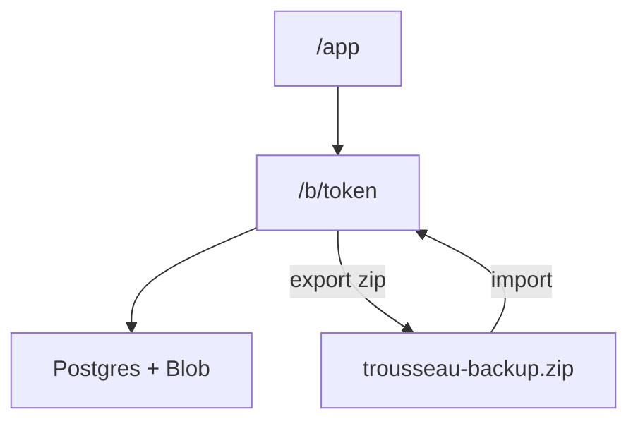

# Privacy

Trousseau is cloud-synced by a **secret share URL**. There are no accounts.

## How sharing works

Opening the tracker resumes your last share link or creates a new one (`/b/…`). Anyone with that URL can view and edit. Treat the link like a password — don’t post it publicly.

- Budget rows live in Vercel Postgres; receipt files in Vercel Blob.
- Each device caches a copy in IndexedDB for a fast UI.
- Export a zip anytime for an offline archive you control.
- Importing a zip creates a **new** share link for that data.

Clearing site data removes the local cache; the share link still opens the cloud budget until you lose the URL.
